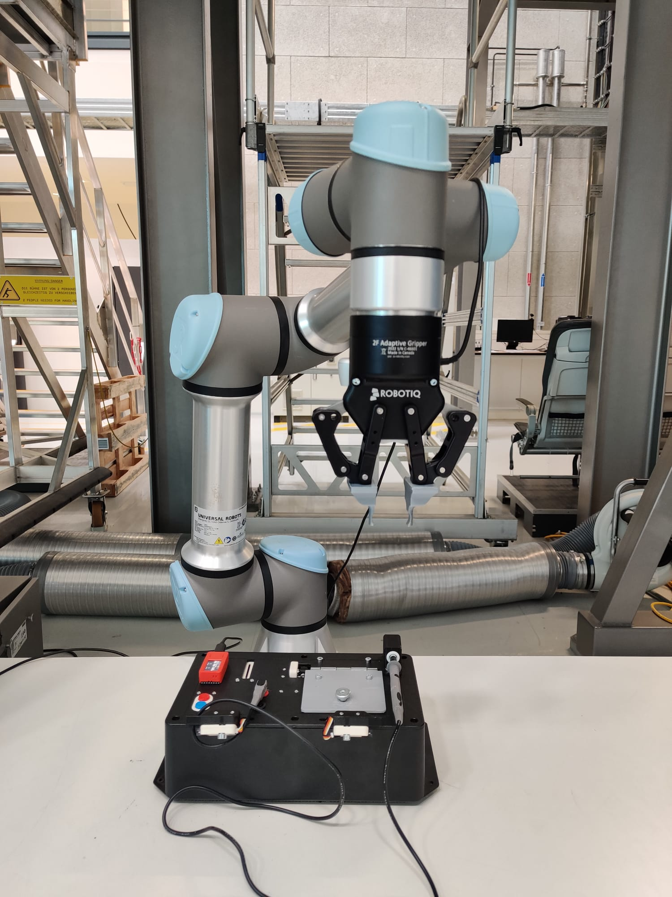
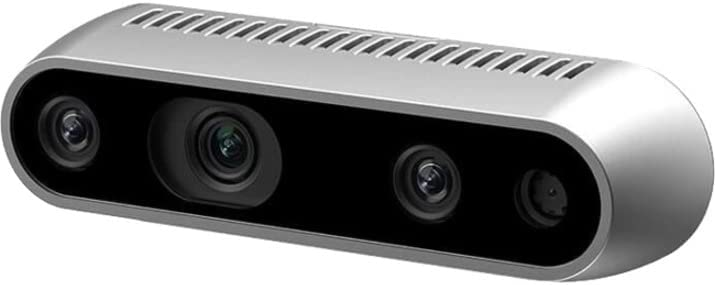
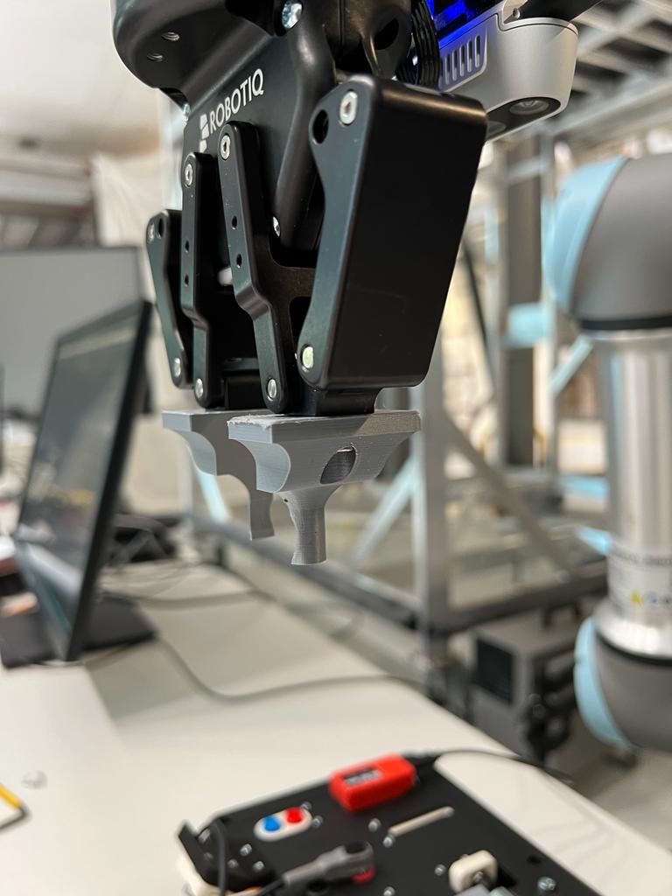

# Robothon 2023 Grand Challenge SYNbotics Team Report
 Authors : Adithya Kumar Chinnakonda Ravi, Aishwarya Krishnamurthy, Charan Raja Sathish
## Hardware Setup
 The robot setup used for this grand challenge is as shown below. 
 
 
 
 We use a Realsense d435i and a custom made 3d printed gripper along with the 2F85 gripper. 
 
 
 

 The setup consists of : 
 - UR5e universal robotic Arm mounted on an aluminium frame placed behind the table where the taskboard is placed
 - We have a custom made 3D printed gripper attached on the 2F85 adaptive robotiq gripper.
 - We use d435i realsense camera which is placed on a small 3d mount on top of the gripper
 
 The taskboard is placed and displayed as shown below: 
 

## Software Dependency List
 The code implementation depends on :
 - Third Party software:
    - [ROS Noetic](http://wiki.ros.org/noetic/Installation/Ubuntu)
    - [UR5e_ robot_driver](https://github.com/UniversalRobots/Universal_Robots_ROS_Driver)
    - [realsense_ros](https://github.com/IntelRealSense/realsense-ros)
    - [robotiq_gripper](https://github.com/ros-industrial/robotiq)
    - [Realsense SDK](https://www.intelrealsense.com/sdk-2/)
    - [moveit](https://moveit.ros.org/install/)

 - Software developed for robothon
    - [robothon_motion](https://github.synergeticon.com/a-ravi/robothon-2023/tree/development/robothon_motion)
    - [robothon_vision](https://github.synergeticon.com/a-ravi/robothon-2023/tree/development/robothon_vision)

 - Code dependencies
    - Python version 3.8
        - Numpy
        - Matplotlib
        - Scikit-image, scikit-learn
        - OpenCV

## Quick Start Guide
- Setup PC/desktop with ROS Noetic to run the robot
- Setup the UR5e universal robot control using this control guide. [UR5e control guide](https://github.com/UniversalRobots/Universal_Robots_ROS_Driver)
  - Run ```roslaunch ur_robot_driver ur5e_bringup.launch robot_ip:=myIP ```	
  - Run ``` roslaunch ur5e_moveit_config ur5e_moveit_planning_execution.launch```
- Launch Realsense Camera using ```roslaunch realsense2_camera rs_camera.launch align_depth:=true```
- Activate gripper using robotiq connector ```roslaunch robotiq_connector robotiq_bringup.launch```
- Start moveit-calibration launch file 
- Run ```rosrun robothon_vision boardDetection.py``` to get the feature detection running
- Run ```rosrun robothon_motion boardTouch.py``` to start running the robothon tasks in order of the script 
 


